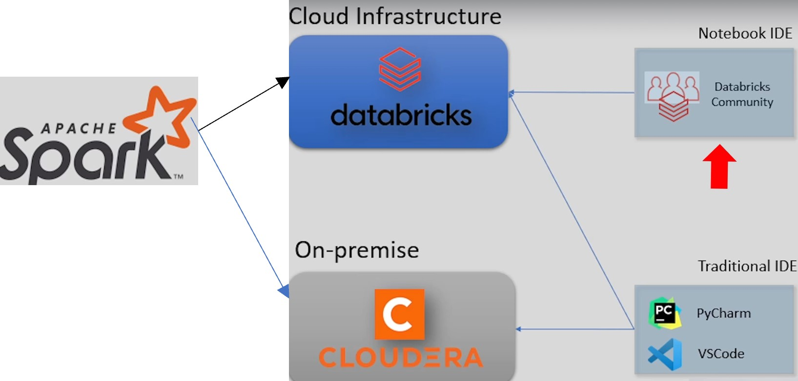
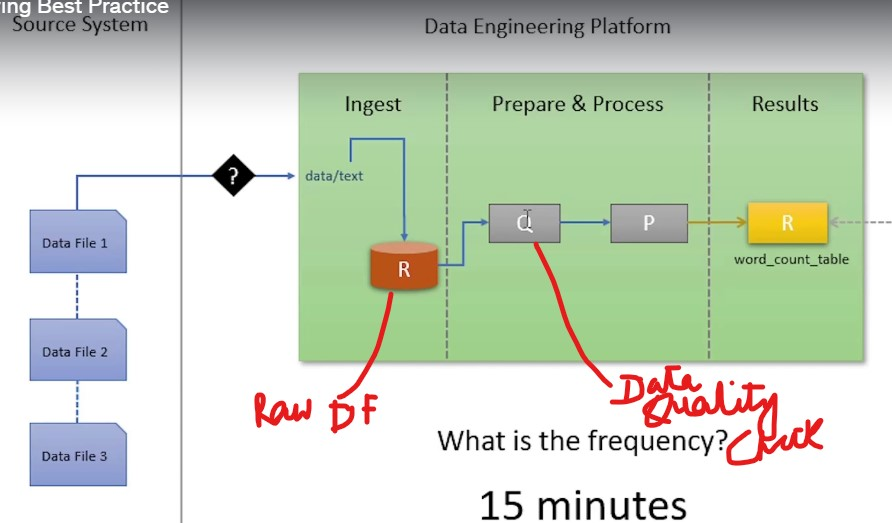
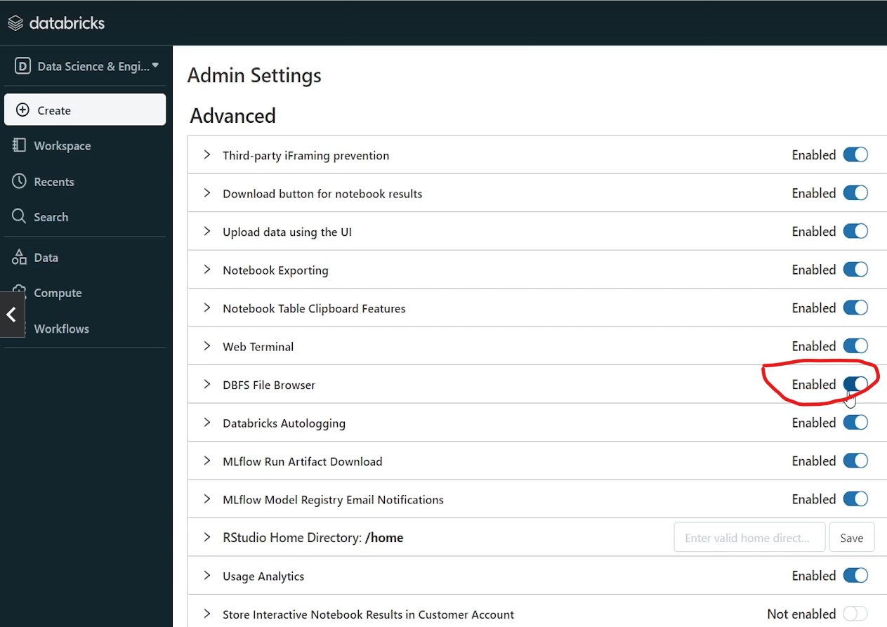
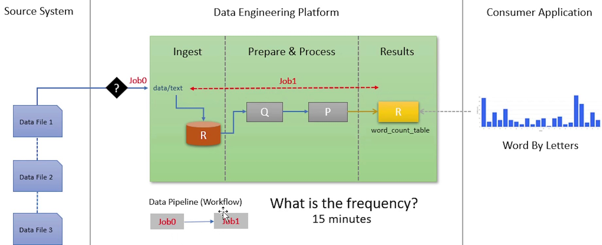
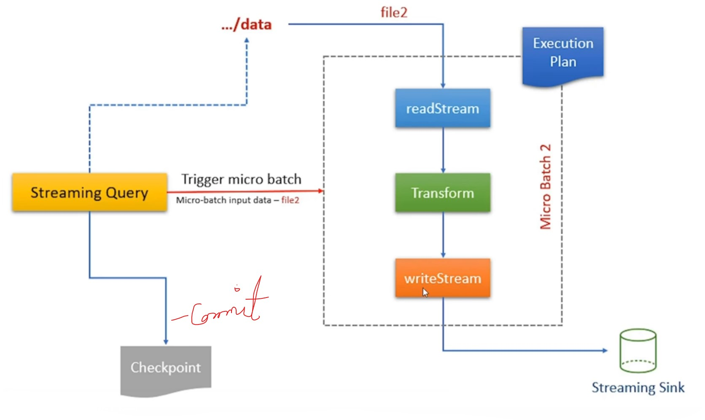

## Spark Overview







### For Streaming

To change the read/write to `readStream`/`writeStream`, use the following code:

    - outputMode can be complete/append/overwrite
    - it returns a streaming query which can be hold in sQuery (given below), whereas the write method don't
```python
 - return (flattenedDF.writeStream
                    .format("delta")
                    .option("checkpointLocation", f"{self.base_data_dir}/checkpoint/invoices")
                    .outputMode("append")
                    .toTable("invoice_line_items")
        )

 - sQuery = wc.wordCount()
 - stop at the end of execution         sQuery.stop()


```
## Stream Processing Flow with API
### Streaming Query background process ensures reading only the new data in each micro batch


### Available-now trigger
 - It can be unspecified
 - Fixed interval
```python
    flattenedDF.writeStream.format("delta")
            .option("checkpointLocation", f"{self.base_data_dir}/chekpoint/invoices")
            .outputMode("append")
            .trigger(processingTime='4 seconds')
            .toTable("invoice_line_items")
```
 - Available now
 ```python
    flattenedDF.writeStream.format("delta")
            .option("checkpointLocation", f"{self.base_data_dir}/chekpoint/invoices")
            .outputMode("append")
            .trigger(availableNow=True)
            .toTable("invoice_line_items")
```

### Max Files Limit
##### default 1K files
```python
sQuery = (flattenedDF.writeStream
                    .format("delta")
                    .option("checkpointLocation", f"{self.base_data_dir}/chekpoint/invoices")
                    .outputMode("append")
                    .option("maxFilesPerTrigger", 1)                    
                )
        
        if (trigger == "batch"):
            return ( sQuery.trigger(availableNow = True)
                         .toTable("invoice_line_items"))
        else:
            return ( sQuery.trigger(processingTime = trigger)
                         .toTable("invoice_line_items"))
```
### Difference between streaming continuously and batch mode
##### Set the streaming with configuration triggering time (example, 30 sec) and based on the other settings it will pick the new files only from the base directory
```python
streamQuery = iStream.process("30 seconds")
```
##### When set as batch, it will trigger the batch and process the no. of files as set by maxFilesPerTrigger
##### if maxFilesPerTrigger set to 1 as in our example, it will process the 2nd file in 2nd batch, even if it exist in the base directory
```python
        iStream.process("batch")
        self.waitForMicroBatch(10)        
        self.assertResult(200)
        print("Validation passed.\n")
```
where 
```python
class streamingBatchTestSuite():
    def appendInvoices(self, flattenedDF, trigger = "batch"):
        sQuery = (flattenedDF.writeStream
                    .format("delta")
                    .option("checkpointLocation", f"{self.base_data_dir}/chekpoint/invoices")
                    .outputMode("append")
                    .option("maxFilesPerTrigger", 1)                    
                )


    def process(self, trigger = "batch"):
           print(f"Starting Invoice Processing Stream")
           invoicesDF = self.readInvoices()
           ------------
           sQuery = self.appendInvoices(resultDF, trigger)
           print("Done\n")
           return sQuery
```

### The difference between source and sink - sink supports additional `foreach` option
- Supported
  - File/Directory
  - Delta Table
  - Kafka
  - Other Connectors
  
